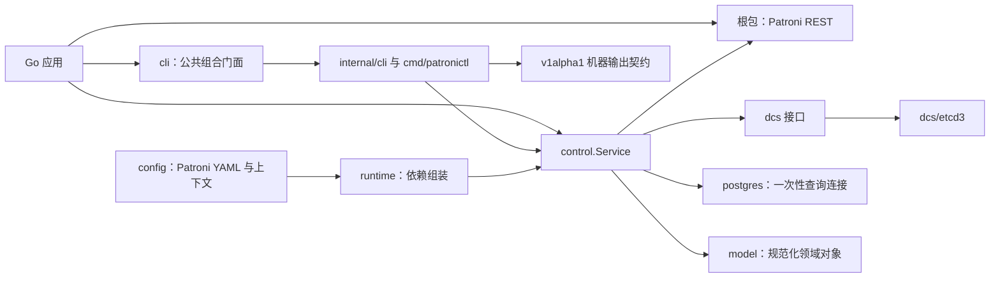

# Go Patroni SDK 中文指南与实现审计

> 审计日期：2026-07-17
>
> 审计起点：`go-patroni` 提交
> `d1178f51b9a80e93ff54459ee0e1610bde4a915c`；本文同时记录本轮工作树修复结果
>
> 上游基线：Patroni 4.1.4，固定提交
> `d701f7b9c3d7e8cb400092d30170ff507697bce9`

本文既是 SDK 使用手册，也是一次针对当前实现的契约审计。规范性边界请以
[`docs/spec`](spec/README.md)、[`compatibility`](../compatibility) 与
[`schema/machine/v1alpha1`](../schema/machine/v1alpha1) 为准。

如果希望从实际任务出发快速选择“直接 REST、配置化高级 SDK、交互 CLI 或 Agent
JSON”入口，请先阅读独立的
[`Go Patroni SDK 与 Agent 中文使用手册`](user-guide.zh-CN.md)。

## 1. 先给结论

`go-patroni` 不是简单的 HTTP 请求封装。它由两层 API 组成：

1. 模块根包提供完整的、强类型的 Patroni REST 客户端；
2. `control.Service` 与 `runtime` 把 DCS、Patroni REST、PostgreSQL、Citus、
   版本门禁、写操作确认与结果证据组合成接近 `patronictl` 的高级 SDK。

本次审计的核心判断如下：

| 问题 | 结论 |
| --- | --- |
| 是否覆盖当前 Patroni 的 REST API？ | **是，按 4.1.4 官方源码中有文档意义的 method/path 契约计算是完整的。** 固定清单包含 75 个 method/path 契约；4.1.4 相比 4.1.3 没有增删路由。 |
| 是否覆盖 `patronictl`？ | **覆盖固定基线的 19 个命令名和主要语义。** 另有 `discover`、`inspect-config` 与 `--all` 扩展；不能据此推导所有输出细节永远与 Python 逐字节相同。 |
| 是否覆盖 Patroni 的所有 DCS 后端？ | **否。** 抽象允许注入其他实现，但 `runtime` 当前只有 etcd v3 原生实现，没有 etcd v2、Consul、ZooKeeper、Kubernetes、Raft 等适配器。 |
| 能否支持更早 Patroni？ | **声明范围是 `>=3.0.0,<5.0.0`，不是无限回溯。** 3.0.4、3.1.2、3.2.2、3.3.11、4.0.10、4.1.4 六个版本已经在隔离的真实 Patroni、etcd 与 TLS 环境全部通过。2.x 及更早版本不在契约内。 |
| 是否存在致命安全设计缺陷？ | 本次没有发现自动重试 REST 写、错误确认成功、或模糊前缀删除这类致命问题。写操作的 `Plan`、CAS、发送状态和 `UNKNOWN` 设计是项目的明显优点。 |
| 本轮修复了什么？ | 已升级事实基线，修复 CLI 查询 TLS、REST CA 信任边界、SemVer、可变全局范围、无效健康参数、无界 Transport 缓存、资源清理、静态检查、Oracle 超时，以及高层 restart 发送空 timeout 的真实兼容 bug；六版本 Patroni、CLI 差分、PostgreSQL 14/16/18 和组合 TLS 矩阵均已实跑。剩余重点是按产品需求决定是否扩展 DCS 后端，并继续提高 etcd3/runtime 的负向路径覆盖。 |

这里的“完整 REST API”有严格含义：覆盖 Patroni 官方 `api.py` 中抽取出的、
受支持版本内的文档化路由契约。它不等于“给 Python 内部所有函数做 Go
绑定”，也不等于“对服务器基类可能接受的任意 HTTP method 都建立公共方法”。

## 2. 项目定位与架构

### 2.1 两种使用层级

如果已经知道某个 Patroni 成员的 REST 地址，只想读取状态或直接调用管理
端点，使用模块根包即可。它不需要 Patroni YAML、DCS 或 PostgreSQL 连接。

如果需要像 `patronictl` 一样从集群名发现成员、选择角色、编辑动态配置、执行
切换、查询数据库或管理 Citus 组，则使用 `runtime` 组装的
`control.Service`。



### 2.2 包职责

| 包 | 主要公共能力 |
| --- | --- |
| `github.com/pgsty/go-patroni` | REST `Client`、75 行端点目录、特性目录、HTTP/TLS/mTLS、认证、原始响应、发送状态错误 |
| `model` | `Target`、集群/成员/角色、规范化状态、Patroni 版本与范围 |
| `config` | 宽容读取 Patroni YAML、命名上下文、覆盖层、字段来源、警告和脱敏检查 |
| `dcs` | `SnapshotReader`、`Discoverer`、`Watcher`、配置/故障转移 CAS、精确集群删除 |
| `dcs/etcd3` | etcd v3 线性一致快照、发现、事务、watch 与压缩后重同步 |
| `postgres` | 收集式/流式多结果集查询、同连接角色校验、行数/字节限制、TLS 模式 |
| `control` | 与适配器无关的读操作、Prepare/Execute 写操作、证据、结果分类和版本门禁 |
| `runtime` | 从有效配置创建 etcd、REST、PostgreSQL 与 `control.Service` |
| `cli` | 面向 Boar、Pig 等宿主的公共命令树组合、程序身份、运行时默认值与扩展命令接口 |
| `cmd/patronictl`、`internal/cli` | 公共门面背后的 Cobra 命令、交互确认、人类输出和版本化机器输出实现 |

### 2.3 三套数据模型不能混为一谈

项目里看似重复的结构，实际上服务于不同契约：

- 根包的 `Status`、`Cluster`、`History` 等是 REST wire DTO；
- `dcs.Snapshot`、`Entry`、`ClusterState` 保留 revision、lease、原始值和解码问题；
- `model.Cluster`、`model.Member` 与 `control.Result` 是跨适配器的规范化领域对象。

例如一个新 Patroni 版本在 `/patroni` 增加字段时，旧 SDK 不会因为未知 JSON
字段而失败，调用方还能从 `Response.Raw` 取到原始内容；但稳定的机器输出不能
因此不经版本化就随意改变。

## 3. 六个核心概念

### 3.1 `model.Target`：完整资源身份

集群的身份不是只有 `scope`，而是：

```text
context + namespace + scope + 可选 Citus group + 可选 member
```

```go
target := model.Target{
    Context:   "production",
    Namespace: "/service/",
    Scope:     "postgres-ha",
}
target = target.Normalize()

fmt.Println(target.ClusterID())
// patroni:cluster/production/%2Fservice/postgres-ha/-
```

`Normalize` 会补全默认 context `default`、默认 namespace `/service` 并清理
路径。Citus 的“没有 group”和“group 0”必须区分。所有跨集群缓存、操作结果、
计划与机器 ID 都应保留完整 Target，不能只拿 scope 当全局键。

### 3.2 DCS 快照：带 revision 的事实

`dcs.Snapshot` 是一次有界、带 revision 的集群读取，包含 10 类 Patroni 键：

```text
initialize, config, members/{name}, leader, failover,
history, status, optime/leader, sync, failsafe
```

它还保留无法完全解码的 `Issues`。这允许上层区分“集群没有该数据”和“DCS
里存在数据但格式异常”。快照只代表读取时刻，不能长期缓存后继续作为写入前提。

### 3.3 `Plan`：写操作不是一个按钮

高级写操作采用两阶段流程：

```text
Prepare -> 展示/确认 Plan -> Execute -> 读取权威证据验证 -> 分类结果
```

Plan 绑定服务实例、Target、请求内容、观察到的状态和前置条件。Execute 会再次
校验，而不是把旧快照当永久许可。CLI 的 `--force` 只能跳过交互询问，不能跳过
版本门禁、前置条件、CAS 或目标校验。

### 3.4 `Result[T]`：数据之外还有证据

所有高级操作都返回：

```go
type Result[T any] struct {
    OperationID string
    Outcome     Outcome
    Target      model.Target
    Path        Path
    Data        T
    Evidence    []Evidence
    Error       *control.Error
}
```

结果只有三种：

- `SUCCEEDED`：有权威证据支持成功；
- `FAILED`：可以证明失败；
- `UNKNOWN`：请求可能已发送或已接受，但最终效果无法证明。

这是 SDK 最重要的安全抽象之一。网络超时发生在写入后时，把操作报告成
`FAILED` 很可能诱导调用方重试并重复执行；SDK 宁可返回 `UNKNOWN`。

### 3.5 路径与证据

`Result.Path` 会表明动作经过 `local`、`dcs`、`rest`、`postgres` 或
`rest->dcs`。证据源可以是 `LOCAL`、`DCS`、`PATRONI`、`POSTGRES`、
`CONTROL`，并携带时间、revision、路径与发送状态。

因此上层产品不应只渲染一个错误字符串，而应保留 `OperationID`、Outcome 和
Evidence，尤其是在 failover、restart、remove 等运维动作中。

### 3.6 版本门禁

根包是直接 wire client，不会在每次调用前探测服务器版本；高级
`control.Service` 则会对写操作检查集群成员版本和特性边界。内置特性表为：

| 特性 | 起始版本 |
| --- | --- |
| 核心 REST | 3.0.0 |
| 通用 `POST /mpp` | 3.3.0 |
| quorum 状态与 failsafe LSN header | 4.0.0 |
| readiness lag/mode、from-leader reinit、standby-cluster CLI | 4.1.0 |

嵌入应用可以按实例缩窄 `>=3.0.0,<5.0.0`，不能扩大。混合版本集群执行写
操作时，所有相关成员都必须处于范围内并支持所需特性。

## 4. 安装与最小使用

模块声明 Go 1.25 或更高版本：

```bash
go get github.com/pgsty/go-patroni@latest
```

安装原生 Go CLI：

```bash
go install github.com/pgsty/go-patroni/cmd/patronictl@latest
patronictl --help
```

## 5. 直接 REST 客户端

### 5.1 创建客户端并读取状态

```go
package main

import (
    "context"
    "errors"
    "fmt"
    "net/http"
    "time"

    patroni "github.com/pgsty/go-patroni"
)

func main() {
    ctx := context.Background()
    client, err := patroni.NewClient(patroni.ClientOptions{
        Timeout:          5 * time.Second,
        MaxResponseBytes: 2 << 20,
        Authorizer:       patroni.NewBasicAuth("patroni", "secret"),
        UserAgent:        "my-controller/1.0",
    })
    if err != nil {
        panic(err)
    }

    response, err := client.GetPatroni(ctx, "https://db1.example.com:8008")
    if err != nil {
        var wireErr *patroni.Error
        if errors.As(err, &wireErr) {
            fmt.Printf("kind=%s delivery=%s status=%d\n",
                wireErr.Kind, wireErr.Delivery, wireErr.StatusCode)
        }
        panic(err)
    }
    if response.StatusCode != http.StatusOK {
        panic(fmt.Sprintf("Patroni returned %d: %s",
            response.StatusCode, response.Raw))
    }
    fmt.Printf("name=%s role=%s version=%s\n",
        response.Data.Patroni.Name,
        response.Data.Role,
        response.Data.Patroni.Version)
}
```

基础地址应是 REST 根地址，例如 `https://host:8008`。根包会把端点追加到现有
path；它拒绝 URL 中的 userinfo、query 与 fragment。用户名密码应通过
`Authorizer` 提供。

### 5.2 `Response[T]` 的语义

每个方法返回的 `Response[T]` 都保存：

- `StatusCode`：HTTP 状态；
- `Header`：克隆后的响应头；
- `Raw`：受大小上限保护的完整原始 body；
- `Data`：成功解码后的强类型数据。

历史版本有一个容易误判的字段边界：Patroni 3.0.x 和 3.1.x 的
`/patroni` 响应只在嵌套 `patroni` 对象中提供 `version` 与 `scope`；`name` 从
3.2.0 才加入。因此旧版本解码后 `response.Data.Patroni.Name == ""` 是合法结果，
不是响应损坏。调用旧版本时应从 DCS member/目标上下文保留节点身份。

仅仅收到非 2xx 并不会统一变成 Go error，因此必须检查 `StatusCode`。成功
状态上的 JSON 解码失败会返回 `DECODE` error，但已经收到的 status、header、
raw 仍然保留。文本端点则把原始 body 同时放在 `Data` 和 `Raw`。

### 5.3 健康检查

```go
response, err := client.GetHealth(ctx, baseURL, patroni.HealthReplica,
    patroni.HealthQuery{
        Lag:  "64MB",
        Tags: map[string]string{"nofailover": "false"},
    })
```

SDK 暴露 18 个 health alias，每个都有 GET/HEAD/OPTIONS。`/quorum` 与
`/read-only-quorum` 从 4.0 才存在。`HealthQuery.ReplicationState` 为保持 Go
源码兼容而保留并标记为 deprecated，但客户端不再把它序列化到请求中，因为
Patroni health handler 从未把 `replication_state` 作为过滤参数。需要判断复制
状态时应读取响应中的 `Status.ReplicationState`。

4.1 的 readiness 参数可以这样使用：

```go
response, err := client.GetReadiness(ctx, baseURL,
    patroni.ReadinessQuery{Lag: "16MB", Mode: "apply"})
```

### 5.4 REST API 清单

75 行不是 75 个完全不同的 URL，而是 method/path 契约数：

| 类别 | 数量 | 方法/路径 |
| --- | ---: | --- |
| health aliases | 54 | 18 个 alias × GET/HEAD/OPTIONS |
| 额外读取 | 8 | `/liveness`、`/readiness`、`/patroni`、`/cluster`、`/history`、`/config`、`/metrics`、`/failsafe` |
| 配置写入 | 2 | PATCH/PUT `/config` |
| 其他动作 | 11 | reload、failsafe、sigterm、restart、switchover、reinitialize、failover、citus、mpp 的 POST/DELETE 组合 |

直接方法完整列表见 [REST Spec](spec/rest-api.md)。需要特别理解的是：

- `PostSigterm` 是测试平台危险端点，不是普通运维命令；
- `PostFailsafe` 是 Patroni 节点间协议；
- `PostCitus`/`PostMPP` 是 MPP 事件端点；
- SDK 覆盖它们并不意味着高级控制层应该让普通用户无条件调用。

### 5.5 动态配置

```go
patch := patroni.DynamicConfig{
    "loop_wait": 10,
    "ttl":       30,
    "postgresql": map[string]any{
        "parameters": map[string]any{
            "max_connections": 300,
        },
    },
}

response, err := client.PatchConfig(ctx, baseURL, patch)
if err != nil {
    // 若是写入后 transport 失败，必须检查 Delivery/MAYBE_SENT，不能盲重试。
    return err
}
if response.StatusCode < 200 || response.StatusCode >= 300 {
    return fmt.Errorf("patch config: status=%d body=%s",
        response.StatusCode, response.Raw)
}
```

直接客户端不会替你做 Plan、版本检查或 DCS 验证；高风险动作应优先使用
`control.Service`。

### 5.6 TLS、mTLS 与加密私钥

```go
tlsOptions := patroni.TLSOptions{
    CAFile:     "/etc/patroni/pki/ca.crt",
    CertFile:   "/etc/patroni/pki/client.crt",
    KeyFile:    "/etc/patroni/pki/client.key",
    ServerName: "db1.example.com",
}.WithKeyPassword("key-passphrase")

transport, err := patroni.NewHTTPTransport(ctx, tlsOptions)
if err != nil {
    return err
}
defer transport.CloseIdleConnections()

client, err := patroni.NewClient(patroni.ClientOptions{Transport: transport})
```

最低 TLS 版本是 1.2，证书和 key 必须成对出现。`String`/`GoString` 只显示
凭据是否存在，不输出密码。显式配置 `CAFile` 时，默认只信任该 bundle；只有
设置 `IncludeSystemCAs: true` 才会把它追加到系统根池。这个默认值既形成清晰的
私有 PKI 边界，也与显式选择 Patroni CA 文件的含义一致。

`TransportCache` 会对 TLS 文件内容做指纹，证书轮转后生成新 transport。默认
使用容量为 8 的并发安全 LRU，驱逐时关闭空闲连接；可通过
`NewTransportCacheWithOptions` 调整容量，并通过 `Purge` 主动清理。

### 5.7 版本化选择

```go
endpoints, err := patroni.EndpointCatalogFor("3.3.8")
supported, err := patroni.SupportsFeature(
    "4.1.4", patroni.FeatureReinitializeFromLeader)
aliases, err := patroni.HealthAliasesFor("4.0.10")
```

这些函数适合直接客户端在发送前选择能力。它们不是服务端协商协议；版本文本仍
需由调用方从状态或 DCS 获得。

## 6. 配置系统

### 6.1 宽容读取 Patroni YAML

`config.Parse`/`Load` 只投影 SDK 所需字段，保留原始 `yaml.Node`，不会因为
正常 Patroni 配置里出现未知字段就拒绝整个文件。

内置来源优先级为：

```text
默认值 -> 配置文件 -> 命名 context -> 环境变量 -> 显式 flags/overrides
```

有效配置会保留每个字段的 `Source{Layer, Name}`，便于 `inspect-config` 解释
“这个值从哪里来”，同时对敏感字段脱敏。

### 6.2 `go_patroni` 扩展

```yaml
scope: postgres-ha
namespace: /service/

etcd3:
  hosts:
    - 10.10.10.10:2379
    - 10.10.10.11:2379

ctl:
  authentication:
    username: patroni
    password: secret
  cacert: /etc/patroni/pki/ca.crt

go_patroni:
  default_context: production
  contexts:
    production: {}
    staging:
      scope: postgres-ha-staging
      etcd3:
        hosts: [10.20.20.10:2379]
  network:
    dns_timeout: 5s
    dcs_dial_timeout: 5s
    dcs_request_timeout: 10s
    patroni_timeout: 10s
    postgres_timeout: 30s
    postgres_close_timeout: 5s
```

`--context` 或 `GO_PATRONI_CONTEXT` 选择上下文。旧的 `boar` 扩展与
`BOAR_CONTEXT` 只用于迁移，不应作为新配置的标准写法。

### 6.3 按操作验证

配置验证不是“一次要求所有连接都存在”：

- local version、inspect-config 不需要网络；
- discover 需要 DCS，不要求固定 scope；
- cluster read、REST write、query 需要 DCS 与 scope；
- 当前验证明确要求 etcd3，其他 DCS 配置不能由 `runtime` 打开。

这个设计允许本地检查配置时不被网络或无关字段阻塞。

## 7. `runtime` 与高级 SDK

### 7.1 从配置组装环境

```go
package main

import (
    "context"
    "fmt"

    "github.com/pgsty/go-patroni/config"
    "github.com/pgsty/go-patroni/control"
    patroniruntime "github.com/pgsty/go-patroni/runtime"
)

func listCluster(ctx context.Context) error {
    environment, err := patroniruntime.NewEnvironment(ctx,
        patroniruntime.EnvironmentOptions{
            Load: config.LoadRequest{
                Path: "/etc/patroni/patronictl.yaml",
            },
            UserAgent:      "my-controller/1.0",
            ProductVersion: "my-controller 1.0",
        })
    if err != nil {
        return err
    }

    rt, err := environment.Open(ctx, patroniruntime.RuntimeOptions{
        Context:       "production",
        Operation:     config.OperationClusterRead,
        ExplicitScope: "postgres-ha",
    })
    if err != nil {
        return err
    }
    defer rt.Close()

    result := rt.Service.List(ctx, control.ListRequest{
        Targets: []model.Target{rt.Target},
    })
    if result.Outcome != control.Succeeded {
        return result.Error
    }
    fmt.Printf("%+v\n", result.Data)
    return nil
}
```

上述片段还需要导入：

```go
import "github.com/pgsty/go-patroni/model"
```

`Runtime.Close` 会关闭 etcd client 并释放 REST idle connections，调用方必须
负责关闭它。`Runtime.Warnings` 应在实际执行前展示或记录。

### 7.2 只检查配置

```go
rt, err := environment.OpenConfiguration(ctx, "production")
if err != nil {
    return err
}
result := rt.Service.InspectConfiguration(ctx,
    control.InspectConfigurationRequest{Resolved: rt.Resolved})
```

这条路径不会连接 etcd、Patroni 或 PostgreSQL，适合配置诊断与 CI。

### 7.3 读取操作

高级服务提供：

| 能力 | 方法 |
| --- | --- |
| 发现与多集群 | `Discover`、`ListAll`、`TopologyAll` |
| 单集群信息 | `List`、`Topology`、`TopologyGroups` |
| 连接目标 | `DSN`，只返回 host/port，不返回密码 |
| DCS 数据 | `ShowConfig`、`History` |
| SQL | `Query` |
| 版本 | `Version` |
| 配置诊断 | `InspectConfiguration` |

读取结果也有 Evidence。对于超出支持范围的服务器，必须显式设置相应请求的
`AllowUnsupportedRead` 才能 best-effort 读取；这个选项不会放宽写操作。

### 7.4 Prepare/Execute 写操作

以 reload 为例：

```go
request := control.ReloadRequest{
    Target:  rt.Target,
    Members: []string{"pg-test-2"},
}

prepared := rt.Service.PrepareReload(ctx, request)
if prepared.Outcome != control.Succeeded {
    return prepared.Error
}
plan := prepared.Data

// 此处由上层展示 plan.Risk、Targets、Preconditions，并取得授权。

executed := rt.Service.ExecuteReload(ctx, request, plan)
switch executed.Outcome {
case control.Succeeded:
    return nil
case control.Failed:
    return executed.Error
case control.Unknown:
    // 不要自动重试；保存 OperationID/Evidence，交给后续核验或人工判断。
    return executed.Error
default:
    return fmt.Errorf("unexpected outcome %q", executed.Outcome)
}
```

同样的两阶段族包括：

- reload、restart、reinitialize；
- failover、switchover；
- flush scheduled restart/switchover；
- pause、resume；
- edit-config；
- remove；
- demote-cluster、promote-cluster。

restart 的可选字段只有在调用方显式设置时才会上线。特别是未设置 timeout 时，
高层服务必须省略该 JSON 字段；`"timeout":""` 会被真实 Patroni 以 400 拒绝，
并不等价于采用默认超时。

高级服务会根据命令选择 REST、DCS CAS 或 REST 后 DCS 验证路径。不要绕过 Plan
自行复制内部选择逻辑，否则容易丢失混合版本检查、Citus group 或模糊发送处理。

## 8. DCS 抽象与 etcd3

### 8.1 为什么只暴露窄接口

`dcs` 没有公共的任意 `Put(key, value)`。它把能力拆成：

```go
type SnapshotReader interface {
    Snapshot(context.Context, model.Target) (Snapshot, error)
}

type ConfigCAS interface {
    CompareAndSwapConfig(
        context.Context, model.Target, []byte, *int64,
    ) (WriteResult, error)
}
```

此外还有 `Discoverer`、`Watcher`、`FailoverCAS` 与 `ClusterRemover`。这样可以
防止上层绕过 Patroni 语义随意写 DCS，也便于新后端只实现实际需要的能力。

### 8.2 etcd3 保证

内置 `dcs/etcd3`：

- 使用线性一致 range read 和 header revision 形成快照；
- discovery 有默认 100,000 key 上限；
- config/failover 写使用 mod revision CAS；
- watch 从 snapshot revision 之后开始；
- etcd history 被压缩时，发出完整 resnapshot；
- remove 删除精确的 cluster prefix，不做文本相似匹配；
- endpoint URL 不接受 userinfo，凭据通过独立字段传递。

### 8.3 其他 DCS 后端

如果要支持 Kubernetes 或 Consul，需要实现相同的 Patroni 语义，而不只是把
接口机械映射到 KV：

- 快照必须有可用于并发判断的一致 revision；
- CAS 冲突必须可辨认；
- watch 必须解释断线、历史丢失和重同步；
- namespace/scope/group 的路径必须与 Patroni 完全一致；
- 删除必须是精确集群根。

完成实现后，可直接向 `control.NewService` 注入；`runtime` 当前没有通用后端
注册机制，需要同时扩展组装层。

## 9. PostgreSQL 查询封装

### 9.1 收集结果

```go
client, err := postgres.NewClient(postgres.ClientOptions{
    Timeout:      20 * time.Second,
    CloseTimeout: 3 * time.Second,
    DefaultLimits: postgres.Limits{
        MaxRows:  1000,
        MaxBytes: 4 << 20,
    },
})
if err != nil {
    return err
}

connection := postgres.ConnectionOptions{
    Host:     "db1.example.com",
    Port:     5432,
    Database: "postgres",
    Username: "operator",
}.WithPassword("secret").WithTLSMode(postgres.TLSVerifyFull)

result, err := client.QueryChecked(ctx, connection,
    postgres.RecoveryPrimary,
    postgres.QueryRequest{SQL: "select now(), pg_is_in_recovery()"})
```

`RecoveryPrimary`/`RecoveryStandby` 的校验与用户 SQL 在同一物理连接执行；角色
不匹配时用户 SQL 不会发送。这避免了“先在连接 A 检查、再在连接 B 执行”的
竞态。

### 9.2 流式结果

大结果集使用 `Stream`/`StreamChecked` 与自定义 `postgres.Sink`。Sink 的三个
回调是同步的，返回错误会取消当前查询并关闭一次性连接：

```text
BeginResult -> WriteRow * N -> EndResult
```

默认上限为 10,000 行与 16 MiB，默认查询超时 30 秒、关闭超时 5 秒。只有显式
`Unlimited` 才取消行/字节限制。

### 9.3 TLS 模式的重要差异

模式有：

- `TLSVerifyFull`：加密并验证 CA 与主机名；也是零值默认；
- `TLSInsecure`：加密但跳过证书验证；
- `TLSDisable`：禁用 TLS；
- `TLSFromSource`：保留连接串/环境/libpq 来源解析出的 SSL 行为。

直接使用 `postgres.Client` 时，即使连接串写了 `sslmode=disable`，零值
`ConnectionOptions` 仍会由安全的 `verify-full` 策略覆盖；希望遵守来源时必须
显式调用 `WithTLSMode(TLSFromSource)`。原生 Go `patronictl query` 已明确选择
`TLSFromSource`，因此会保留连接串、环境和 libpq 来源的 SSL 行为，与上游 CLI
保持一致，同时不削弱直接 SDK 的默认安全策略。

### 9.4 `control.Query` 的双层错误

为了兼容 `patronictl` 的展示习惯，SQL 错误可能出现在 `QueryData.Error`，而
外层 control Outcome 仍是 `SUCCEEDED`：控制层成功连接到了 PostgreSQL，并取得
了要展示的服务器错误。调用方必须同时检查外层 Outcome 和内层 query error。

## 10. 原生 `patronictl`

固定基线的 19 个命令全部存在：

| 命令 | 能力 |
| --- | --- |
| `dsn` | 选择 leader/role/member 并生成不含凭据的 DSN |
| `query` | 对选择出的成员执行 SQL |
| `remove` | 精确删除一个 Patroni 集群根 |
| `reload` | 重载成员配置 |
| `restart` | 立即或计划重启 |
| `reinit` | 重建 replica/standby |
| `failover` | 无健康 leader 时故障转移 |
| `switchover` | 计划或立即切换 |
| `list` | 集群成员列表 |
| `topology` | 复制拓扑 |
| `flush` | 取消计划 restart/switchover |
| `pause` / `resume` | 维护模式 |
| `edit-config` / `show-config` | 动态配置编辑与查看 |
| `version` | 本地和成员版本 |
| `history` | timeline history |
| `demote-cluster` / `promote-cluster` | Patroni 4.1 standby-cluster 操作 |

Go CLI 额外提供 `discover`、`inspect-config` 和多集群 `--all`。`-o` 输出稳定
JSON/YAML envelope，schema 位于 `schema/machine/v1alpha1`。自动化应该消费
机器格式，不要解析人类表格。

宿主程序可通过公共 `cli` 包嵌入整棵命令树，并注册自己的顶层命令；核心
`control`/`runtime` 仍不依赖 Cobra。嵌入程序不会创建第二套机器协议：envelope
继续使用 `patroni.pgsty.com/v1alpha1`，`VersionInfo.application` 仅以可选字段记录
宿主名称、构建信息与收窄后的 Patroni 支持范围。

## 11. 兼容性与历史版本

### 11.1 REST 路由演进

| Patroni | 行数 | 变化 |
| --- | ---: | --- |
| 3.0-3.2 | 68 | 核心 health/status/config/restart/failover/switchover/Citus |
| 3.3 | 69 | 新增通用 `POST /mpp` |
| 4.0 | 75 | 新增两个 quorum alias，每个有 GET/HEAD/OPTIONS |
| 4.1 | 75 | 路由数不变，新增 readiness、reinit 与 standby-cluster 语义 |

4.1.4 相对 4.1.3 没有路由或命令增删，所以当前客户端的 method/path 覆盖仍然
完整。4.1.4 修复了 `patroni_postgres_server_version` metric 文本中的空格问题，
把 `patroni_postgres_timeline` 的 TYPE 从 counter 改为 gauge，并修复一个 ctl
错误格式路径。因为 `/metrics` 以原始文本返回，SDK 不会因类型 DTO 解码失败；
但固定源码、文档与差分证据仍应升级到 4.1.4。

### 11.2 可以回溯到哪里

当前代码主动拒绝 3.0 以下和 5.0 及以上版本。它没有为 Patroni 2.x 做路由、
DCS payload、术语、CLI 参数或真实集群验证，因此不能宣称支持。

默认真实矩阵目标已经扩展为 `v3.0.4`、`v3.1.2`、`v3.2.2`、`v3.3.11`、
`v4.0.10`、`v4.1.4`，integration test 也按受支持 minor 判断能力，不再把三个
旧 patch 写死。2026-07-17 已使用同一固定 PostgreSQL base manifest 的镜像源
运行完整矩阵，六个目标全部 PASS。真实测试同时确认 `/patroni` 的 `name` 字段
边界位于 3.2.0：3.0.4/3.1.2 合法缺失，3.2.2 及以后存在。

### 11.3 向前兼容策略

- REST JSON 的未知字段被忽略，原始 body 被保留；
- endpoint/feature 目录记录 `since`；
- 高级写操作在未知/不支持版本上 fail closed；
- unsupported read 只有显式 opt-in 才 best effort；
- 新 major 默认不在支持范围，避免假装兼容。

版本比较遵守 SemVer 预发布优先级，`4.1.0-rc1 < 4.1.0`；支持范围还对下一个
major 的预发布版本 fail closed，因此 `5.0.0-rc1` 不会被误认为 `<5.0.0`。

## 12. 实现审计

### 12.1 审计方法

本次审计执行了以下工作：

- 扫描全部 Go 包、公共类型/方法、命令树、契约清单、machine schema 与测试；
- 对固定 Patroni 4.1.4 源码及 4.1.3→4.1.4 变更做路由、命令和语义差分；
- 检查 3.0、3.3、4.0、4.1 的路由演进与 SDK feature gate；
- 执行 unit、vet、race、integration compile、schema check、coverage、lint 与
  vulnerability scan；
- 执行六版本真实 Patroni、4.0/4.1 `patronictl` 语义差分、PostgreSQL
  14/16/18、etcd mTLS 与组合 TLS 矩阵，并记录 tag、commit 和镜像摘要。

严重度含义：P1 应在下一次发布前处理；P2 应排入近期迭代；P3 是清理与可维护性
改进。本次没有定为 P0 的问题。

### 12.2 修复状态总表

以下状态以本轮修改后的工作树和第 13 节验证输出为准：

| ID | 状态 | 本轮结果或剩余边界 |
| --- | --- | --- |
| R-01 | **FIXED** | Go `patronictl query` 使用 `TLSFromSource`；直接 PostgreSQL SDK 继续以 `verify-full` 为安全默认。 |
| R-02 | **FIXED** | 显式 `CAFile` 默认建立独占根池；`IncludeSystemCAs` 提供明确的系统根追加选项。 |
| R-03 | **FIXED** | 固定到 4.1.4；git checkout 与源码归档可逐字节生成同一清单；CI 增加生成器和 Oracle gate。 |
| R-04 | **FIXED** | 版本比较实现 SemVer 预发布优先级，并对下一个 major 的预发布版本 fail closed。 |
| R-05 | **FIXED** | SDK 内部只使用私有 canonical range；`AuditedPatroniRange` 返回副本，旧导出变量仅作 deprecated 源码兼容快照。 |
| R-06 | **FIXED** | Transport cache 改为默认容量 8 的 LRU，支持容量配置与 `Purge`，驱逐时关闭空闲连接。 |
| R-07 | **FIXED** | 字段保留以兼容源码，但已 deprecated 且不再序列化无效参数。 |
| R-08 | **FIXED** | Patroni 3.0/3.1/3.2/3.3/4.0/4.1 六版本矩阵和 PostgreSQL 14/16/18 的 TLS、plaintext-only 路径均已在真实容器通过。 |
| R-09 | **OPEN / SCOPE** | 高级 runtime 仍只内置 etcd3；这是明确产品边界，而不是 4.1.4 REST 路由缺失。 |
| R-10 | **PARTIAL** | `runtime` 覆盖率从 10.4% 提升到 47.2%，总覆盖率为 66.7%；etcd 3.6.13 mTLS/认证负向矩阵已通过，但 `dcs/etcd3` 仍为 33.1%，权限、CAS 与 watch compaction 的更多真实错误路径仍需覆盖。 |
| R-11 | **FIXED** | 删除死代码，正确合并 close error，`golangci-lint 2.11.3` 从 21 项降到 0。 |
| R-12 | **MITIGATED** | CI 使用 Go 1.26.x 最新补丁并强制 `govulncheck`；同机切换到 Go 1.26.5 后扫描为 0 vulnerabilities。系统默认 1.26.4 仍命中标准库漏洞。 |
| R-13 | **FIXED** | 真实 4.1.4 测试发现高层 restart 把未设置的 timeout 作为空字符串发送并收到 400；现仅在显式设置时赋值，并有单元与六版本真实回归。 |

下面保留审计起点的问题细节与原始修复建议，便于解释修改动机；它们描述的是
修复前状态，不能覆盖上表的当前结论。

### 12.3 审计起点的 P1：发布与兼容性风险

#### R-01 PostgreSQL 查询默认 TLS 与上游不兼容

位置：`postgres/connection.go`、`internal/cli` query 路径。

`ConnectionOptions` 零值和 `NewConnectionOptions` 都默认 `verify-full`。Go CLI
创建连接时没有提供与上游等价的 SSL 选择入口。Python `patronictl` 通常只传
host/port/dbname 给 psycopg，未指定时采用 libpq 的 `prefer` 语义。

影响：标准的、只开放明文 PostgreSQL 的 Patroni 集群可能可以使用上游
`patronictl query`，却无法使用 Go CLI query。现有 PostgreSQL 集成环境只测
TLS=on，无法发现此差异；`compatibility/deviations.yaml` 又是空的。

建议：

1. CLI 默认使用 `TLSFromSource`，保持连接串/环境/libpq 语义；或
2. 增加明确的 CLI/config SSL mode，并把 `verify-full` 作为有意安全增强记录为
   deviation；
3. 同时增加 TLS、plaintext-only、错误 CA、hostname mismatch 四类矩阵。

#### R-02 自定义 REST CA 扩大而非收窄信任根

位置：`tls.go` 的 `buildHTTPTransport`。

实现先读取 `x509.SystemCertPool()`，再追加 `CAFile`。上游在显式提供 ctl
`cacert`/REST `cafile` 时通常把该 bundle 作为所选 CA 文件。两者不仅是兼容性
差异，也影响私有 PKI 的信任边界。

影响：配置私有 CA 后，Go 客户端仍可能信任系统公共根签发的证书；有些部署者
会错误地认为只信任私有 CA。

建议：增加 `exclusive`/strict CA 模式；从 patronictl 兼容角度考虑让显式 CA
默认替换根池。任何默认变更都要有迁移说明和系统根/私有根组合测试。

#### R-03 固定证据已落后，且生成器自检不可复现

位置：`compatibility/*`、`test/compat/oracle/extract_inventory.py`、
`tools/compatgen`。

仓库固定 4.1.3，而当前稳定版已是 4.1.4。虽然路线和命令数量没变，metric 与
ctl error 语义已经变化。

此外，文档让用户传入 Patroni git checkout，但固定的
`patroni-source.yaml` 写着 `sourceKind: github-tag-archive`。同一固定 commit 的
干净 git checkout 会生成 `sourceKind: git-checkout`，并通过 `%aI` 写入 author
timestamp；archive 常量则使用 committer timestamp。两处内容差异都会导致
`compatgen -check` 报 `patroni-source.yaml` stale。也就是说，公开的校验方式与
已提交产物不能逐字节复现。

建议：升级固定基线到 4.1.4；让 source kind 不参与内容一致性，或规定并自动
构造唯一形式的 archive；在 CI 同时执行 generator check 与 Oracle tests。

### 12.4 审计起点的 P2：正确性、边界与可维护性

#### R-04 版本比较不是完整 SemVer

位置：`model/version.go`。

`Version.Compare` 只比较 major/minor/patch，忽略 `Suffix`，所以
`4.1.0-rc1 == 4.1.0`。这会在预发布版本上提前启用 readiness、from-leader
reinit 或 standby-cluster 等特性。

建议：实现 SemVer 预发布优先级，或明确拒绝带预发布 suffix 的服务器进入写
路径。增加 rc、dev、发行版附加文本与 major boundary 测试。

#### R-05 可变的全局支持范围

位置：`model.SupportedPatroniRange`。

它是导出的 `var`，外部包能修改，进而影响 `Endpoint.AvailableIn`、版本校验和
其他调用方。这与 README 所强调的“实例级缩窄、无全局状态”目标冲突。

建议：把全局值改成不可被外部修改的私有值加返回副本函数；实例缩窄继续使用
`ServiceOptions`/`EnvironmentOptions`。

#### R-06 TLS TransportCache 无界增长

位置：`tls.go`。

每组证书内容指纹都会永久留在 map 中；`CloseIdleConnections` 只关闭连接，不
清空 map。频繁轮换证书或使用大量租户材料的长生命周期进程可能持续增长。

建议：增加容量上限和 LRU、按 identity 主动替换，或提供 `Purge`/`Close` 并
定义并发语义。

#### R-07 `HealthQuery.ReplicationState` 是无效能力

位置：`endpoints.go`。

SDK 会序列化 `replication_state=...`，但检查的 Patroni 3.x/4.x health handler
只读取 `lag` 和 `tag_*`。`replication_state` 是响应字段，而不是该请求过滤器。

建议：下一个允许破坏性清理的版本删除字段；在此前弃用并停止宣传。如果确需
某版本定制能力，应以明确的 version/vendor capability 建模。

#### R-08 3.0-3.2 与无 TLS 环境没有真实矩阵

位置：`scripts/test-patroni-integration.sh`、
`test/integration/patroni_rest_test.go`。

脚本默认 tag 和测试白名单只含 3.3.8、4.0.7、4.1.3；即使通过环境变量传入
3.0/3.1/3.2 或新的 4.1.4，Go 测试也会拒绝。

建议：测试逻辑根据 endpoint catalog 计算预期能力，不要写死三个 patch；矩阵
至少加入 3.0.x、当前 3.3 patch、4.0 patch、最新 4.1 patch，并加入 PostgreSQL
TLS on/off。

#### R-09 高级 DCS 能力只有 etcd3

这不是 REST SDK 缺失，但会限制“Go 版 patronictl”在 Patroni 生态中的覆盖。
建议按实际需求排序实现 Kubernetes、Consul 等后端，或明确产品只承诺 etcd3。
新后端必须达到 snapshot revision、CAS、watch 重同步与精确删除语义，不能仅
实现基本 KV 读写。

#### R-10 关键组装与适配器测试覆盖偏低

本次 `go test -cover ./...` 总覆盖率约 65.6%。主要包快照：

| 包 | 覆盖率 |
| --- | ---: |
| 根包 | 82.6% |
| `config` | 80.9% |
| `control` | 77.6% |
| `dcs` | 84.8% |
| `dcs/etcd3` | 33.1% |
| `postgres` | 79.2% |
| `runtime` | 10.4% |
| `internal/cli` | 46.8% |

低覆盖不直接证明有 bug，但 `runtime` 的资源清理、TLS/DNS/配置分支，以及
etcd3 的实际错误映射恰好是高风险边界。建议优先补组装失败清理、Close error、
endpoint 解析、CAS 冲突、watch compaction 与权限错误测试。

#### R-11 静态检查债务

`golangci-lint 2.11.3` 报告 21 项：

- 3 个未使用 helper：`control/reload.go`、`internal/cli/render.go`、
  `postgres/connection.go`；
- 多个未处理 `Close` error，包括 REST response body、SQL 文件和 CLI runtime；
- `control/failover.go` 有 error 返回值不在最后的 ST1008；
- `model/version.go`、`tools/compatgen/main.go` 有 ST1005 error 文本问题；
- 其余一部分是测试代码的 nil context/close 检查。

建议删除死代码；逐个判断 close error 是否应并入主错误，不能为了清零一律忽略
或一律覆盖主错误。

#### R-12 构建工具链有可达标准库漏洞

在审计机的 Go 1.26.4 上执行 `govulncheck ./...`，报告标准库
`GO-2026-5856`，并给出可到达 TLS 路径；该问题标注在 Go 1.26.5 修复。这是
构建/发布工具链风险，不是某个第三方模块直接引入的 SDK 逻辑漏洞。

建议 CI 与发布镜像固定到所选 Go minor 的最新安全 patch，并把
`govulncheck` 纳入 release gate。`go.mod` 的最低 Go 版本不等于发布时应使用的
安全版本。

#### R-13 高层 restart 把未设置 timeout 发送为空字符串

位置：`control/restart.go`。

`patroni.RestartRequest.Timeout` 为 `any`，原实现把高层请求的空字符串直接赋给
该 interface。即使字段带 `omitempty`，包含 `""` 的非 nil interface 仍会被
编码为 `"timeout":""`。真实 Patroni 4.1.4 对此返回 HTTP 400；这说明只看 Go
类型与 mock 成功响应无法发现该问题。

本轮改为仅在调用方设置非空 timeout 时赋值，未设置时完全省略字段，并在单元
测试中断言捕获到的 wire DTO 为 nil。修复随后通过 3.0.4 到 4.1.4 六版本真实
矩阵。直接 REST 调用仍保留数字秒数或 Patroni duration string 两种合法形式。

### 12.5 P3：清晰度与工程体验

- `compatibility/*.yaml` 实际生成的是 JSON 文本。JSON 是合法 YAML，但后缀与
  内容会让工具/读者困惑；可统一成 `.json`，或真正输出规范 YAML。
- Go 1.25 最低版本对部分下游环境可能是采用成本，应确认是否确实使用了只能由
  该版本提供的能力。
- 4.1 standby-cluster 的 demote/promote 与 scheduled 参数已经进入命令表和
  Spec；后续语义变化仍应同步维护。
- DCS Oracle 超时已经改为可通过 `GO_PATRONI_ORACLE_TIMEOUT` 配置，默认 1 分钟；
  本轮完整 projection 与 mutation Oracle 均通过。

## 13. 本次验证结果

### 13.1 已通过

```text
go test -mod=readonly ./...                         PASS
go vet ./...                                        PASS
go build ./cmd/patronictl                           PASS
go test -race -mod=readonly ./...                   PASS
go test -run '^$' -tags=integration ./test/integration
                                                     PASS（仅编译）
go run ./tools/machineschema -check                 PASS
golangci-lint run ./...                             PASS（0 issues）
compatgen -check：4.1.4 git checkout                PASS
compatgen -check：4.1.4 无 .git 源码归档            PASS
go test -tags=oracle ./test/compat                  PASS（完整 Oracle）
GOTOOLCHAIN=go1.26.5 govulncheck ./...              PASS（0 vulnerabilities）
git diff --check / CI workflow YAML parse           PASS
```

本轮 `go test -coverprofile` 的语句总覆盖率为 66.7%。其中根包 83.0%、
`control` 78.0%、`postgres` 80.3%、`runtime` 47.2%、`internal/cli` 47.0%、
`dcs/etcd3` 33.1%。覆盖率是风险导航，不是兼容性证明。

### 13.2 真实协议矩阵

Docker Hub 元数据在本机不可达时，Oracle 使用
`mirror.gcr.io/library/postgres@sha256:57c72fd2a128e416c7fcc499958864df5301e940bca0a56f58fddf30ffc07777`。
该 manifest digest 与脚本固定的官方 `postgres:16-alpine` digest 完全相同；
构建内 Python 包下载通过 8118 HTTP proxy。注册表主机替换没有放宽镜像身份。
两个 Oracle 脚本也会拒绝 `@sha256` 后缀不是该固定值的 override。

六版本 Patroni REST/TLS 结果如下；`image` 是本次实际 Oracle image ID：

```text
3.0.4  commit=a4d29eb99ea4e943f9d4fdae48ba9d14b46c567c  image=sha256:9caffc012e4a2a9d36fcc6596ace6a44b77b8357ad1ab9ad268e804aecc66333  PASS
3.1.2  commit=710afd59520b54bb05f7d61bf6bbc76738425eea  image=sha256:5eeaf661648b098baaadf99ba0fd36b5ee1f30b080cd68247d45a0f2d00bf391  PASS
3.2.2  commit=c8e32775df20f73d473c0694b09c727d1f0dfe07  image=sha256:b3a5e2f136242031fe9fac69a6fbfe80a487a98f4430d4de0bd697b5ccbd34f7  PASS
3.3.11 commit=3ab81653293c60584035cf062b690d861d1c8ca1  image=sha256:bc23788169729c94a423f1f476a67e16badccec71df8ecb5cab91d02dfdd0a8b  PASS
4.0.10 commit=099db547ad06add0fa728ce8941ee8841b11fa89  image=sha256:89f7d40e521c7923b0fdc53c6b173e5ee690ce8520d07dc1b97dd9c916bdb519  PASS
4.1.4  commit=d701f7b9c3d7e8cb400092d30170ff507697bce9  image=sha256:7cae03bfaa74ffbc8cdd19e7ee55c259314d37bebb450e8e0619d877a4ce6907  PASS
```

其余真实与差分矩阵：

| 矩阵 | 实际版本/身份 | 结果 |
| --- | --- | --- |
| Python `patronictl` 语义差分 | 4.0.10：26 cases，facts SHA-256 `1e749c44d60c1cfcac192c5e9f5df1c12c338d595e0a8e5463ba26e1c9776d37`；4.1.4：29 cases，`201d291cdc2d581f375c49d155d7233880a7ab315022d406cf6b74f2ea878000` | PASS |
| PostgreSQL TLS/SCRAM + plaintext-only | 14.23 `sha256:f1341c01408dc7278e9d365ed4f860cd3f87dd16b4464ac326fc0f422083a579`；16.14 `sha256:57c72fd2a128e416c7fcc499958864df5301e940bca0a56f58fddf30ffc07777`；18.4 `sha256:9a8afca54e7861fd90fab5fdf4c42477a6b1cb7d293595148e674e0a3181de15` | 六条路径全部 PASS |
| etcd mTLS/auth 及负向证书/凭证 | etcd 3.6.13，`sha256:f5a43614f4a7c74891b9fc3aecd27197af896911e24a203046acd094dd34f8bc` | PASS |
| 组合 TLS gate | etcd 3.6.13 + Patroni 4.1.4 + PostgreSQL 18.4 | PASS |

这轮真实测试发现并修复了两个仅靠原 mock 难以暴露的问题：未设置 restart
timeout 被编码为空字符串，以及 3.0/3.1 合法缺少 `patroni.name` 的历史响应边界。

### 13.3 工具链限制

系统默认 `go version go1.26.4` 下运行 `govulncheck ./...` 仍会命中可达的标准库
`GO-2026-5856`。同一工作树显式使用已修复的 Go 1.26.5 后为 0 vulnerabilities。
因此 release gate 的结论是“必须使用已修复工具链”，而不是把默认工具链失败
误报为 SDK 依赖漏洞或忽略它。

## 14. 剩余改进路线

本轮已经完成 4.1.4 事实链、主要行为/安全修复、lint 清理、runtime 单元测试和
真实协议矩阵。
剩余工作按证据价值排序：

1. 补 etcd3 的权限错误、watch compaction、连接失败和 CAS 冲突真实测试，并继续
   覆盖 runtime 组装失败的资源回收；
2. 把六版本 Patroni、PostgreSQL 多版本和组合 TLS 矩阵纳入可周期执行的受控环境，
   避免 point-in-time PASS 随上游镜像或 runner 漂移而失效；
3. 让发布工具链至少使用 Go 1.26.5，并保留 CI 中的 `govulncheck` release gate；
4. 如果目标是在所有 Patroni 环境替代 Python `patronictl`，再实现 Kubernetes、
   Consul 等 DCS backend；如果目标主要是 Pigsty/etcd3，则保持并公开 etcd3-only
   产品边界，不把“可注入接口”误写成“后端已覆盖”；
5. 评估 `compatibility/*.yaml` 的 JSON-in-YAML 命名与低覆盖适配器，作为维护性
   改进，不把它们与 REST route 覆盖缺失混为一谈。

## 15. 维护者检查表

任何 Patroni 升级或 API 变更，都应同时回答：

- 上游 tag、commit、release note 与源码 hash 是什么？
- method/path 数量之外，请求字段、默认值、状态码、header、metric 与错误语义
  是否变化？
- CLI 命令、参数、prompt、exit behavior 与输出是否变化？
- DCS key、payload、CAS/watch 语义是否变化？
- 新特性从哪个版本开始，混合版本集群如何处理？
- 旧 payload 是否仍能解码，新字段是否能从 `Response.Raw` 回溯？
- 是否更新了 compatibility、deviations、Spec、machine schema 与中文文档？
- unit、race、Oracle、differential、最老版本、特性边界和最新版本真实矩阵是否
  真正执行，而不只是编译？
- 报告中的 PASS、SKIP、BLOCKED、FAIL 是否准确区分？

遵守这套检查表，`docs/spec` 才不是一次性文档，而是项目升级时可以反复验证的
“事实基因”。

## 16. 上游参考

- [Patroni 4.1.4 REST API](https://patroni.readthedocs.io/en/latest/rest_api.html)
- [Patroni 4.1.4 patronictl](https://patroni.readthedocs.io/en/latest/patronictl.html)
- [Patroni v4.1.4 release](https://github.com/patroni/patroni/releases/tag/v4.1.4)
- [Patroni v4.1.3...v4.1.4 source diff](https://github.com/patroni/patroni/compare/v4.1.3...v4.1.4)
