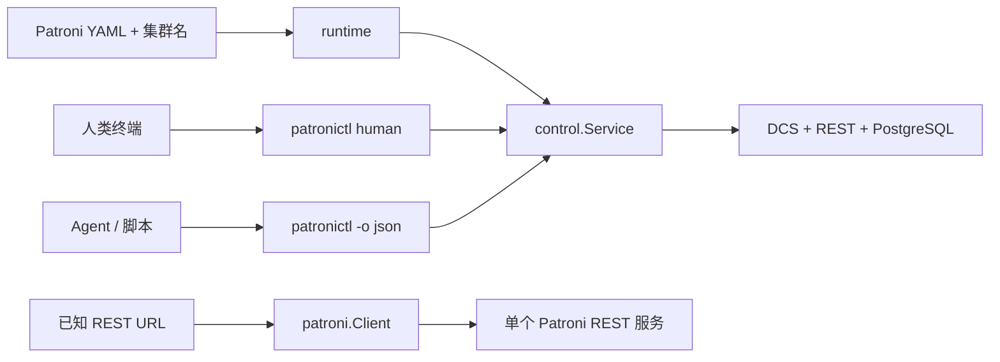

# Go Patroni SDK 与 Agent 中文使用手册

> 适用项目：`github.com/pgsty/go-patroni`
>
> 上游事实基线：Patroni 4.1.4
>
> 审计兼容范围：Patroni `>=3.0.0,<5.0.0`

这份手册面向三类使用者：直接在 Go 代码中调用 Patroni REST API 的开发者、
希望从 Patroni YAML 出发获得 `patronictl` 式体验的应用开发者，以及通过命令行
驱动集群的自动化 Agent。

它回答两个最常见的问题：

1. 已经知道某个 Patroni 节点的 REST 地址，怎样直接调用 API？
2. 只有 Patroni 配置文件和集群名，怎样发现集群并进行类似 `patronictl` 的管理？

更完整的 API 覆盖、兼容性证据和实现审计见
[`go-patroni-sdk.zh-CN.md`](go-patroni-sdk.zh-CN.md)；规范性边界见
[`docs/spec`](spec/README.md)。

## 1. 先选对入口

项目不是一个“万能 Client”，而是三个由低到高的使用入口：

| 你的场景 | 推荐入口 | 需要什么 | 主要返回值 |
| --- | --- | --- | --- |
| 已知节点 REST URL，只需调用 `/patroni`、`/cluster`、`/config` 等端点 | 模块根包 `patroni.Client` | URL、TLS、认证 | `patroni.Response[T]` |
| Go 应用需要按 scope 发现成员，并安全地执行集群管理 | `runtime` + `control.Service` | Patroni YAML、etcd3 可达 | `control.Result[T]` |
| 运维人员需要交互式管理 | `patronictl` 人类输出 | 配置文件、终端 | 表格、提示和退出码 |
| Agent、脚本或控制器需要进程级集成 | `patronictl -o json` | 配置文件、JSON 解析器 | 版本化 envelope 和退出码 |

可以把它们理解为三条路径：



从体验上看：

- 直接 REST Client 最轻。地址已知时几行代码就能工作，但节点选择、HTTP 状态、
  写后验证和重试策略由调用者负责。
- 高级 SDK 最完整，也最显式。配置加载、目标身份、计划、执行、证据和最终结果
  分层呈现，代码比普通 HTTP SDK 多一些，但这正是管理高可用数据库所需的安全边界。
- `patronictl` 是当前最顺手的人类入口；Agent 则应使用同一命令的 JSON 模式，
  不应解析人类表格或提示文字。

## 2. 安装与导入

SDK 要求 Go 1.25 或更新版本。

```bash
go get github.com/pgsty/go-patroni@latest
```

安装原生命令行：

```bash
go install github.com/pgsty/go-patroni/cmd/patronictl@latest
patronictl --help
```

常用包的导入方式如下：

```go
import (
    patroni "github.com/pgsty/go-patroni"
    "github.com/pgsty/go-patroni/config"
    "github.com/pgsty/go-patroni/control"
    "github.com/pgsty/go-patroni/model"
    patroniruntime "github.com/pgsty/go-patroni/runtime"
)
```

## 3. 路径一：直接调用 Patroni REST API

### 3.1 最小可运行示例

已知节点地址，例如 `http://10.10.10.11:8008`，不需要 Patroni YAML、DCS 或
PostgreSQL 连接。

```go
package main

import (
    "context"
    "fmt"
    "log"
    "net/http"
    "time"

    patroni "github.com/pgsty/go-patroni"
)

func main() {
    ctx, cancel := context.WithTimeout(context.Background(), 8*time.Second)
    defer cancel()

    client, err := patroni.NewClient(patroni.ClientOptions{
        Timeout:   5 * time.Second,
        UserAgent: "my-controller/1.0",
    })
    if err != nil {
        log.Fatal(err)
    }

    response, err := client.GetPatroni(ctx, "http://10.10.10.11:8008")
    if err != nil {
        log.Fatal(err)
    }
    if response.StatusCode != http.StatusOK {
        log.Fatalf("Patroni returned HTTP %d", response.StatusCode)
    }

    status := response.Data
    fmt.Printf("scope=%s member=%s role=%s state=%s patroni=%s\n",
        status.Patroni.Scope,
        status.Patroni.Name,
        status.Role,
        status.State,
        status.Patroni.Version,
    )
}
```

这里有两个必须同时检查的通道：

1. `error` 表示请求构造、认证、传输、响应体读取或成功响应解码失败；
2. `Response.StatusCode` 表示 Patroni 的 HTTP 结果。非 2xx 不会自动变成 Go
   `error`，因此不能只写 `if err != nil`。

`Response[T]` 包含：

| 字段 | 含义 |
| --- | --- |
| `StatusCode` | HTTP 状态码 |
| `Header` | 响应头 |
| `Data` | 已解码的强类型结果 |
| `Raw` | 原始响应字节，用于前向兼容或受控诊断 |

不要把 `Raw` 直接写入普通日志。它是兼容性逃生口，不是默认日志字段。

### 3.2 Basic Auth、TLS 与 mTLS

生产环境通常需要 CA 校验、客户端证书和 Basic Auth：

```go
transport, err := patroni.NewHTTPTransport(ctx, patroni.TLSOptions{
    CAFile:     "/etc/patroni/pki/rest-ca.crt",
    CertFile:   "/etc/patroni/pki/rest-client.crt",
    KeyFile:    "/etc/patroni/pki/rest-client.key",
    ServerName: "db1.example.com",
})
if err != nil {
    return err
}
defer transport.CloseIdleConnections()

client, err := patroni.NewClient(patroni.ClientOptions{
    Transport:  transport,
    Authorizer: patroni.NewBasicAuth("patroni", password),
    Timeout:    5 * time.Second,
    UserAgent:  "my-controller/1.0",
})
if err != nil {
    return err
}
```

私钥有密码时使用副本式配置：

```go
tlsOptions := (patroni.TLSOptions{
    CAFile:   "/etc/patroni/pki/rest-ca.crt",
    CertFile: "/etc/patroni/pki/rest-client.crt",
    KeyFile:  "/etc/patroni/pki/rest-client.key",
}).WithKeyPassword(keyPassword)
```

安全默认值如下：

- 最低 TLS 版本为 TLS 1.2；
- 显式 `CAFile` 默认是独占信任集合，不会悄悄混入系统 CA；
- 只有确实需要“私有 CA + 系统 CA”时才设置 `IncludeSystemCAs: true`；
- `InsecureSkipVerify` 默认为 `false`，只应在明确隔离的测试环境短暂使用；
- endpoint URL 不接受嵌入式用户名和密码。

### 3.3 常用读取 API

模块根包直接覆盖 Patroni 4.1.4 的文档化 method/path 契约。日常最常用的方法是：

| Go 方法 | Patroni 端点 | 用途 |
| --- | --- | --- |
| `GetPatroni` | `GET /patroni` | 当前成员状态、角色、版本、时间线等 |
| `GetCluster` | `GET /cluster` | 当前节点看到的集群成员 |
| `GetConfig` | `GET /config` | 动态配置 |
| `GetHistory` | `GET /history` | 切换历史 |
| `GetMetrics` | `GET /metrics` | Prometheus 文本指标 |
| `GetFailsafe` | `GET /failsafe` | failsafe topology |
| `GetHealth` | 多个健康别名 | primary、replica、leader 等健康检查 |
| `HeadHealth` | 健康别名的 `HEAD` | 只判断 HTTP 结果，不读取状态体 |
| `OptionsHealth` | 健康别名的 `OPTIONS` | 查询端点能力 |
| `GetLiveness` | `GET /liveness` | 进程存活性 |
| `GetReadiness` | `GET /readiness` | 服务就绪性 |

健康别名不是任意字符串，应从项目的 `HealthAlias` 常量中选择。例如：

```go
response, err := client.GetHealth(ctx, baseURL, patroni.HealthReplica,
    patroni.HealthQuery{
        Lag:  "64MB",
        Tags: map[string]string{"zone": "az1"},
    })
```

可以通过 `HealthAliasesFor(version)` 和 `EndpointCatalogFor(version)` 获取某个
Patroni 版本实际支持的契约，也可以用 `SupportsFeature` 做功能门禁。完整的 75 行
端点清单由 [`compatibility/rest-api.yaml`](../compatibility/rest-api.yaml) 固定。

### 3.4 直接写 API

直接 REST Client 还提供以下写操作：

| Go 方法 | 行为 |
| --- | --- |
| `PatchConfig`、`PutConfig` | 修改或替换动态配置 |
| `PostReload` | reload 成员配置 |
| `PostRestart`、`DeleteRestart` | 立即/预约重启，或清除预约 |
| `PostReinitialize` | 重新初始化副本 |
| `PostFailover` | 故障切换 |
| `PostSwitchover`、`DeleteSwitchover` | 执行/预约切换，或清除预约 |
| `PostFailsafe` | 更新 failsafe peer 信息 |
| `PostSigterm` | 请求 Patroni 进程退出 |
| `PostCitus`、`PostMPP` | Patroni MPP/Citus 事件 |

例如修改一个动态参数：

```go
response, err := client.PatchConfig(ctx, baseURL, patroni.DynamicConfig{
    "loop_wait": 10,
})
if err != nil {
    return err
}
if response.StatusCode < 200 || response.StatusCode >= 300 {
    return fmt.Errorf("patch Patroni config: HTTP %d", response.StatusCode)
}
```

直接写入适合以下场景：你已经精确选择了节点、理解这个 Patroni 端点的语义，
并且能够自行完成写前检查和写后验证。对于通用管理产品，优先使用后面的
`control.Service`，因为它提供 Prepare/Execute、版本门禁和最终证据。

### 3.5 写入失败后能不能重试

REST 写操作永远不会被 SDK 自动重试，也不会跟随写重定向。发生 Go `error`
时，可以取得投递证据：

```go
response, err := client.PostReload(ctx, baseURL)
if err != nil {
    var patroniError *patroni.Error
    if errors.As(err, &patroniError) {
        switch patroniError.Delivery {
        case patroni.DeliveryNotSent:
            // 请求确定没有发出；在重新检查前提后，可以由业务决定是否重试。
        case patroni.DeliveryMaybeSent:
            // 请求可能已经到达 Patroni；禁止盲目重试，先重新读取状态。
        case patroni.DeliveryResponseReceived:
            // 已经收到响应，结合 StatusCode 和操作语义处理。
        }
    }
    return err
}
_ = response
```

需要额外导入标准库 `errors`。也可以用 `patroniError.AmbiguousWrite()` 快速判断
`MAYBE_SENT`。

最重要的规则是：超时不等于操作没有执行。对 restart、failover、switchover、
reinitialize 和配置修改等写操作，`MAYBE_SENT` 后应先重新观察集群，再决定下一步。

### 3.6 版本差异

直接 DTO 对未知 JSON 字段保持宽容，原始字节也会保存在 `Response.Raw`。但调用者
仍应知道两个边界：

- 审计支持范围是 Patroni `>=3.0.0,<5.0.0`；
- Patroni 3.0 和 3.1 的 `/patroni` 响应没有 `patroni.name`，因此
  `Status.Patroni.Name` 会是空字符串；该字段从 3.2.0 开始存在。

## 4. 路径二：加载 Patroni YAML 并获得管理 SDK

直接 REST 只面对一个 URL。高级路径则从配置文件开始，通过 DCS 找到 scope、成员
和 REST 地址，再把 DCS、REST 与 PostgreSQL 能力组装为 `control.Service`。

### 4.1 配置文件长什么样

SDK 可以读取普通 Patroni YAML 中与管理有关的字段。下面是一份可用于服务端和
管理端的示意配置：

```yaml
scope: pg-meta
namespace: /service

etcd3:
  hosts:
    - 10.0.0.10:2379
    - 10.0.0.11:2379
  protocol: https
  cacert: /etc/patroni/pki/etcd-ca.crt
  cert: /etc/patroni/pki/etcd-client.crt
  key: /etc/patroni/pki/etcd-client.key
  username: patroni
  password: replace-me

ctl:
  insecure: false
  cacert: /etc/patroni/pki/rest-ca.crt
  certfile: /etc/patroni/pki/rest-client.crt
  keyfile: /etc/patroni/pki/rest-client.key
  authentication:
    username: patroni
    password: replace-me

go_patroni:
  default_context: production
  contexts:
    production: {}
    staging:
      scope: pg-meta-staging
      etcd3:
        hosts:
          - 10.20.0.10:2379
  network:
    dns_timeout: 5s
    dcs_dial_timeout: 5s
    dcs_request_timeout: 10s
    patroni_timeout: 10s
    postgres_timeout: 30s
    postgres_close_timeout: 5s
```

`go_patroni` 是 SDK 的可选扩展。它增加命名上下文和显式网络时限，不改变 Patroni
自己的字段含义。配置解析会保留不认识的 Patroni 字段，不会因为服务端配置中还有
`postgresql`、`bootstrap` 或自定义字段而拒绝整个文档。

配置文件应限制为仅属主可读，例如 `chmod 600`。SDK 不会把普通字符串占位符自动
替换为环境变量；密码应通过受保护的部署流程写入，而不是依赖隐式字符串展开。

### 4.2 配置选择与覆盖顺序

未显式指定路径时，SDK 使用平台用户配置目录下的
`patroni/patronictl.yaml`。也可以通过以下方式选择：

- Go：`config.LoadRequest{Path: "/etc/patroni/patroni.yml"}`；
- 环境变量：`PATRONICTL_CONFIG_FILE=/etc/patroni/patroni.yml`；
- CLI：`patronictl -c /etc/patroni/patroni.yml ...`。

有效配置按以下顺序叠加，后者覆盖前者：

1. SDK 默认值；
2. Patroni YAML 根配置；
3. `go_patroni.contexts.<name>`；
4. 支持的环境变量；
5. Go 或 CLI 显式覆盖。

上下文可以由 `--context`、`GO_PATRONI_CONTEXT` 或
`go_patroni.default_context` 选择。

### 4.3 先做本地配置检查

首次接入时，先走不联网的配置检查路径：

```go
environment, err := patroniruntime.NewEnvironment(ctx,
    patroniruntime.EnvironmentOptions{
        Load: config.LoadRequest{Path: "/etc/patroni/patroni.yml"},
    })
if err != nil {
    return err
}

rt, err := environment.OpenConfiguration(ctx, "production")
if err != nil {
    return err
}
defer rt.Close()

result := rt.Service.InspectConfiguration(ctx,
    control.InspectConfigurationRequest{Resolved: rt.Resolved})
if result.Outcome != control.Succeeded {
    return result.Error
}
```

`OpenConfiguration` 不连接 etcd、Patroni REST 或 PostgreSQL。检查结果包含脱敏后的
有效配置、每个字段的来源和安全警告，适合在 CI 或启动前诊断中使用。

### 4.4 完整的集群读取示例

下面的程序从 YAML 加载 `production` 上下文，通过 etcd3 找到 `pg-meta`，然后读取
成员列表：

```go
package main

import (
    "context"
    "fmt"
    "log"
    "time"

    "github.com/pgsty/go-patroni/config"
    "github.com/pgsty/go-patroni/control"
    "github.com/pgsty/go-patroni/model"
    patroniruntime "github.com/pgsty/go-patroni/runtime"
)

func main() {
    ctx, cancel := context.WithTimeout(context.Background(), 15*time.Second)
    defer cancel()

    environment, err := patroniruntime.NewEnvironment(ctx,
        patroniruntime.EnvironmentOptions{
            Load: config.LoadRequest{
                Path: "/etc/patroni/patroni.yml",
            },
            UserAgent:      "my-controller/1.0",
            ProductVersion: "my-controller 1.0",
        })
    if err != nil {
        log.Fatal(err)
    }

    rt, err := environment.Open(ctx, patroniruntime.RuntimeOptions{
        Context:       "production",
        Operation:     config.OperationClusterRead,
        ExplicitScope: "pg-meta",
    })
    if err != nil {
        log.Fatal(err)
    }
    defer func() {
        if closeErr := rt.Close(); closeErr != nil {
            log.Printf("close Patroni runtime: %v", closeErr)
        }
    }()

    for _, warning := range rt.Warnings {
        log.Printf("configuration warning: %s", warning)
    }

    result := rt.Service.List(ctx, control.ListRequest{
        Targets: []model.Target{rt.Target},
    })
    if result.Outcome != control.Succeeded {
        log.Fatalf("list cluster: %s", result.Error)
    }

    for _, cluster := range result.Data.Clusters {
        fmt.Printf("cluster=%s leader=%s revision=%d\n",
            cluster.Target.Scope, cluster.Leader, cluster.Revision)
        for _, member := range cluster.Members {
            fmt.Printf("  %-20s role=%-15s state=%s\n",
                member.Name, member.Role, member.State)
        }
    }
}
```

`Runtime.Close` 会关闭 etcd client 和 REST idle connections，调用方必须负责执行。
长期运行的服务应为每次操作设置 caller-owned deadline，而不是只依赖内部默认时限。

### 4.5 不知道 scope 时先发现

如果配置只给出了 namespace 和 DCS，可以先扫描该 namespace 下的 Patroni 集群：

```go
rt, err := environment.Open(ctx, patroniruntime.RuntimeOptions{
    Context:   "production",
    Operation: config.OperationDiscover,
})
if err != nil {
    return err
}
defer rt.Close()

result := rt.Service.Discover(ctx, control.DiscoverRequest{
    Context:   rt.Target.Context,
    Namespace: rt.Target.Namespace,
})
if result.Outcome != control.Succeeded {
    return result.Error
}
```

发现使用规范化 namespace 前缀，并排除无关或孤立键。选择一个结果后，应继续保留完整
`model.Target`，不能只保存 scope。

### 4.6 `model.Target` 为什么不能简化成 cluster name

高级 SDK 用 `model.Target` 表示目标身份：

```text
context + namespace + scope + optional group + optional member
```

同名 scope 可以存在于不同上下文或 namespace 中；Citus 还可能有不同 group。
因此缓存键、审计记录、确认信息和 Agent 参数都应保留完整 Target。只用
`scope=pg-meta` 作为全局唯一键，迟早会选错集群。

### 4.7 为每种操作选择正确的 runtime 模式

`RuntimeOptions.Operation` 决定启动前需要验证哪些配置：

| 操作 | 用途 | 是否需要 DCS | 是否需要 scope |
| --- | --- | --- | --- |
| `OperationInspect` | 本地配置检查 | 否 | 否 |
| `OperationDiscover` | namespace 集群发现 | 是 | 否 |
| `OperationClusterRead` | list、topology、dsn、history、version | 是 | 是 |
| `OperationRESTWrite` | reload、restart、failover 等 | 是 | 是 |
| `OperationQuery` | 选择成员并执行 PostgreSQL 查询 | 是 | 是 |

不要为所有命令统一使用最严格模式，否则本地检查会被网络状态阻塞；也不要为写操作
使用读取模式规避校验。

### 4.8 `control.Result[T]` 是最终操作结果

每个高级方法都返回：

```go
type Result[T any] struct {
    OperationID string
    Outcome     control.Outcome
    Target      model.Target
    Path        control.Path
    Data        T
    Evidence    []control.Evidence
    Error       *control.Error
}
```

三个 Outcome 的含义是：

| Outcome | 含义 | 调用方动作 |
| --- | --- | --- |
| `SUCCEEDED` | 有权威证据支持成功 | 使用 `Data` |
| `FAILED` | 有权威证据支持失败或写入确定未发送 | 根据错误类别决定是否修正/重试 |
| `UNKNOWN` | 写入可能已接受或发送，但无法验证结果 | 停止自动重试，重新观察集群并升级处理 |

不要用 `result.Error == nil` 代替 Outcome 判断，也不要把 `UNKNOWN` 折叠成普通失败。

### 4.9 管理写操作：Prepare → 审阅 → Execute

高级写操作分成两个阶段。以 reload 指定成员为例：

```go
request := control.ReloadRequest{
    Target:  rt.Target,
    Members: []string{"pg-meta-2"},
}

prepared := rt.Service.PrepareReload(ctx, request)
if prepared.Outcome != control.Succeeded {
    return prepared.Error
}

plan := prepared.Data
fmt.Printf("operation=%s risk=%s retry=%s\n%s\n",
    plan.Operation, plan.Risk, plan.RetrySafety, plan.Summary)
for _, precondition := range plan.Preconditions {
    fmt.Printf("  %s must be %s (%s)\n",
        precondition.Field, precondition.Expected, precondition.Source)
}

// 在这里执行应用自己的授权、审批或用户确认。

executed := rt.Service.ExecuteReload(ctx, request, plan)
switch executed.Outcome {
case control.Succeeded:
    return nil
case control.Unknown:
    return fmt.Errorf("reload outcome is unknown; inspect cluster before retrying")
default:
    return executed.Error
}
```

必须在同一个 `control.Service` 实例上，用同一份规范化 request 执行对应 plan。
Execute 会重新检查前置条件；Plan 不是“跳过验证”的令牌，也不包含凭据或原始请求体。

高级服务对 reload、restart、reinitialize、failover、switchover、pause/resume、
edit-config、remove、flush、demote/promote 等管理动作都采用同类安全模型。特性在目标
Patroni 版本不支持时，会在发送写请求前被拒绝。

### 4.10 高级读取能力

`control.Service` 的主要读取方法包括：

| 能力 | 方法 |
| --- | --- |
| namespace 发现 | `Discover` |
| 多集群成员 | `ListAll` |
| 单/多集群拓扑 | `Topology`、`TopologyGroups`、`TopologyAll` |
| 集群成员列表 | `List` |
| PostgreSQL 目标 | `DSN` |
| DCS 动态配置 | `ShowConfig` |
| 切换历史 | `History` |
| PostgreSQL 查询 | `Query` |
| SDK 与成员版本 | `Version` |
| 本地配置诊断 | `InspectConfiguration` |

查询操作还需要检查 `result.Data.Error`。这是因为 DCS/目标选择可能成功，而选中成员的
PostgreSQL 查询仍可能出现数据库错误、角色不匹配或连接失败。

### 4.11 当前高级 runtime 的边界

`runtime` 当前原生组装的是 `etcd3`。如果 Patroni 使用 Consul、ZooKeeper、
Kubernetes、Raft 或其他 DCS，仍然可以实现 `dcs` 包中的窄能力接口，并自行组装
`control.Service`，但不能指望 `runtime.NewEnvironment(...).Open(...)` 自动支持。

这不影响模块根包的 REST Client；已知 URL 时，它与 DCS 类型无关。

## 5. 路径三：像 `patronictl` 一样使用命令行

### 5.1 最推荐的首次使用顺序

先检查配置，再发现集群，最后读取指定集群：

```bash
patronictl -c /etc/patroni/patroni.yml \
  --context production inspect-config

patronictl -c /etc/patroni/patroni.yml \
  --context production discover

patronictl -c /etc/patroni/patroni.yml \
  --context production list pg-meta
```

如果配置已设置 `go_patroni.default_context`，可以省略 `--context`。也可以设置：

```bash
export PATRONICTL_CONFIG_FILE=/etc/patroni/patroni.yml
export GO_PATRONI_CONTEXT=production
patronictl list pg-meta
```

### 5.2 常用只读命令

```bash
# 列出 namespace 中所有集群
patronictl -c /etc/patroni/patroni.yml --context production list --all

# 查看复制拓扑
patronictl -c /etc/patroni/patroni.yml --context production topology pg-meta

# 查看动态配置与历史
patronictl -c /etc/patroni/patroni.yml --context production show-config pg-meta
patronictl -c /etc/patroni/patroni.yml --context production history pg-meta

# 查看本工具和所有成员版本
patronictl -c /etc/patroni/patroni.yml --context production version pg-meta

# 获取 leader 的 host/port DSN
patronictl -c /etc/patroni/patroni.yml --context production dsn pg-meta
```

`list --all` 和 `discover` 是 Go 实现提供的实用扩展。`--all` 是明确的多集群选择，
不要在自动化里把空 scope 隐式解释成“所有集群”。

### 5.3 执行 SQL

```bash
patronictl -c /etc/patroni/patroni.yml --context production \
  query pg-meta -c 'select now(), pg_is_in_recovery()'
```

这里有一个值得注意的命令行细节：根命令的 `-c` 表示配置文件，而 `query` 子命令的
`-c` 表示 SQL command；根命令的 `-d` 表示 DCS URL，而 `query -d` 表示数据库名。

因此有冲突的全局短选项必须放在子命令之前：

```text
patronictl -c CONFIG query CLUSTER -c SQL
            ^ 根命令             ^ query 子命令
```

长期脚本也可以使用完整选项名提高可读性：

```bash
patronictl --config-file /etc/patroni/patroni.yml \
  query pg-meta --command 'select 1' --dbname postgres
```

### 5.4 常用管理命令

人类模式会先展示计划，并在需要时提示确认：

```bash
# reload 指定成员
patronictl -c /etc/patroni/patroni.yml \
  reload pg-meta pg-meta-2

# 重启指定成员
patronictl -c /etc/patroni/patroni.yml \
  restart pg-meta pg-meta-2

# 计划重启
patronictl -c /etc/patroni/patroni.yml \
  restart pg-meta pg-meta-2 --scheduled 2026-07-18T02:00:00+08:00

# 修改动态配置
patronictl -c /etc/patroni/patroni.yml \
  edit-config pg-meta --set loop_wait=10

# 受控切换
patronictl -c /etc/patroni/patroni.yml \
  switchover pg-meta --leader pg-meta-1 --candidate pg-meta-2
```

`--force` 只跳过交互提示，不会跳过参数验证、版本门禁、CAS、目标检查或安全分类。
对高风险操作，不要把 `--force` 理解为“无条件执行”。

### 5.5 remove 的非交互确认

删除 DCS 中的集群状态是破坏性操作。非交互执行时必须提供精确确认：

```bash
patronictl -c /etc/patroni/patroni.yml -o json \
  remove pg-meta \
  --confirm-cluster pg-meta \
  --acknowledge-removal 'Yes I am aware' \
  --confirm-leader pg-meta-1
```

如果当前存在 leader，还必须提供 `--confirm-leader <leader-name>`。工具会使用精确、
规范化的 DCS 前缀和修订条件，不会把相似 scope 当成删除目标。

具体 acknowledgement 文本以当前命令的提示和 `--help` 为准；自动化在升级二进制后
应重新跑预检，不应猜测确认内容。

## 6. Agent 与自动化使用方式

### 6.1 Agent 的首选接口

如果 Agent 与 SDK 不在同一个 Go 进程中，推荐调用：

```bash
patronictl -c /etc/patroni/patroni.yml \
  --context production -o json list pg-meta
```

不要解析人类表格、颜色、提示语或错误文案。`-o json` 和 `-o yaml` 使用稳定、
有版本号的机器 envelope；JSON 更适合绝大多数 Agent。

成功结果的外形如下：

```json
{
  "apiVersion": "patroni.pgsty.com/v1alpha1",
  "kind": "ClusterList",
  "metadata": {
    "requestId": "...",
    "observedAt": "2026-07-17T12:00:00Z",
    "warnings": []
  },
  "data": {
    "clusters": []
  }
}
```

失败结果仍然是一个 envelope：

```json
{
  "apiVersion": "patroni.pgsty.com/v1alpha1",
  "kind": "Error",
  "metadata": {
    "requestId": "...",
    "observedAt": "2026-07-17T12:00:00Z",
    "warnings": []
  },
  "error": {
    "category": "UNREACHABLE",
    "operation": "list",
    "target": {
      "context": "production",
      "namespace": "/service",
      "scope": "pg-meta"
    },
    "retryable": true,
    "cause": "...",
    "message": "...",
    "evidence": [],
    "nextActions": []
  }
}
```

机器 schema 位于 [`schema/machine/v1alpha1`](../schema/machine/v1alpha1)。Agent 应先
验证 `apiVersion` 和 `kind`，再解析对应 `data` 或 `error`。

### 6.2 退出码契约

进程退出码与机器错误类别共同决定控制流：

| 退出码 | 类别 | 建议动作 |
| ---: | --- | --- |
| 0 | 成功 | 读取 `data` |
| 1 | `FAILED` | 操作有确定失败证据；查看 `error` |
| 2 | `USAGE` / `CONFIG` | 修正参数或配置，不要原样重试 |
| 3 | `UNSUPPORTED` | 版本/能力不支持，不要强行发送写请求 |
| 4 | `AUTH` / `TLS` | 修复身份或信任配置 |
| 5 | `NOT_FOUND` | 重新发现或修正 Target |
| 6 | `CONFLICT` | 状态/修订已变化，重新读取并重新 prepare |
| 7 | `UNREACHABLE` | 只读操作可按策略退避；写操作先看证据 |
| 8 | `UNKNOWN` | 可能已写入；禁止自动重放，先重新观察 |
| 9 | `INTERNAL` | 工具自身或契约错误，停止并升级处理 |

不要只看退出码 1/非 1，也不要只看 `error.retryable`。对于写操作，是否可能已经发送
比“网络错误是否暂时”更重要。

### 6.3 机器模式没有交互提示

机器输出模式会禁用交互式确认。这能防止 Agent 卡在 stdin，但意味着写命令必须提供
显式目标和相应确认，例如成员、candidate、`--force` 或 remove 的三类确认参数。

如果缺少必要信息，命令会在发送写入前以 `USAGE` 失败。Agent 不应通过自动选择
“第一个副本”或自动补 `--force` 来绕过这个行为。

### 6.4 推荐的 Agent 状态机

一个安全的 Agent 调用流程是：

1. 用显式配置、context、scope/group/member 和 caller deadline 发起调用；
2. 保存进程退出码，并从 stdout 解析且仅解析一个 JSON envelope；
3. 校验 `apiVersion`、`kind` 和必要字段；
4. 成功时记录 `metadata.requestId`、目标和安全证据，不记录凭据；
5. `CONFLICT` 时重新读取状态，从新的事实重新生成决策；
6. `UNKNOWN` 时立即停止同一写入的自动重试，执行 list、history、show-config 或
   特定状态读取来判断操作是否已经生效；
7. 只有在写入确定未发送，或操作本身为只读时，才按退避策略自动重试；
8. 达到重试上限或无法建立权威结论时，转人工或上层协调器。

### 6.5 Agent 调用示例

只读发现：

```bash
result="$(patronictl \
  --config-file /etc/patroni/patroni.yml \
  --context production \
  --output json \
  discover)"

printf '%s\n' "$result" | jq -e '
  .apiVersion == "patroni.pgsty.com/v1alpha1" and
  .kind == "ClusterDiscovery"
'
```

实际程序必须同时保存命令退出码；上面的片段只演示 envelope 校验，不是完整重试器。

非交互 restart：

```bash
patronictl \
  --config-file /etc/patroni/patroni.yml \
  --context production \
  --output json \
  restart pg-meta pg-meta-2 --force
```

如果返回退出码 8 或 JSON 中 `error.category == "UNKNOWN"`，不要再次执行同一条
restart；先读取成员状态和 pending restart 信息。

### 6.6 什么时候 Agent 应直接嵌入 Go SDK

以下情况适合在控制器中直接使用 `runtime + control`，而不是 fork CLI：

- 需要复用连接并减少进程启动开销；
- 需要在自己的审批流中展示 `control.Plan`；
- 需要结构化持久化 `Evidence` 与 `OperationID`；
- 需要注入自定义 DCS 实现、认证器、日志器或 Patroni 版本范围；
- 需要把操作 deadline 与现有请求 context 绑定。

以下情况 CLI JSON 更合适：

- Agent 不是 Go 程序；
- 希望以独立进程隔离依赖和故障；
- 希望直接获得固定 schema 与退出码；
- 运维和自动化需要共用同一套命令行为。

## 7. 常见问题与排障

### 7.1 `inspect-config` 成功，但 `list` 失败

这是正常的分层结果。`inspect-config` 是本地操作；`list` 还需要：

- etcd3 endpoint 可解析且可达；
- DCS TLS 和认证正确；
- namespace、scope、可选 Citus group 正确；
- DCS member 数据中存在有效 Patroni REST URL；
- Patroni REST TLS 和认证正确。

先运行 `discover` 判断是 scope 选择问题，还是整个 DCS 连接问题。

### 7.2 配置里有 Consul/Kubernetes，为什么 runtime 拒绝

配置解析器会宽容保留未知或非 etcd3 配置，但内置 runtime 只实现 etcd3 适配器。
这两个事实并不矛盾。可以继续使用直接 REST Client，或实现对应的窄 `dcs` 接口。

### 7.3 REST 调用 `err == nil`，为什么还是失败

因为非 2xx HTTP 结果保存在 `Response.StatusCode` 中。直接 REST 调用必须同时检查
Go error 和状态码。高级 `control.Service` 已把它们归一到 `Result.Outcome`。

### 7.4 超时后应该立即重试吗

只读请求通常可以退避重试；写请求不能按这个规则处理。直接 REST Client 先看
`patroni.Error.Delivery`，高级 SDK/CLI 先看 `Outcome` 或 `error.category`。
`MAYBE_SENT`/`UNKNOWN` 都要求先重新观察。

### 7.5 为什么高级 SDK 看起来比普通 SDK 啰嗦

因为它显式区分：配置事实、完整目标、计划、授权、执行、发送证据和最终验证。
对一个只读 dashboard，这可能显得繁琐；对 failover 或 DCS 删除，它能避免把网络
超时误判为失败、把相似 scope 当成同一集群，或在状态变化后执行过期计划。

可以在自己的应用中封装只读 convenience helper，但不要把高风险写操作压缩成一个
“自动重试直到成功”的函数。

### 7.6 怎样读取超出支持范围的 Patroni

CLI 有 `--allow-unsupported-read`，高级读取 request 有
`AllowUnsupportedRead`。它们只允许 best-effort 读取，不会放宽写操作版本门禁。
Patroni 2.x 和 5.x 不能因此变成已承诺兼容版本。

## 8. 当前使用体验评价

整体上，这套 SDK 的“安全管理体验”强于“首次发现体验”：

- 优点是边界清楚。简单 REST 不强拉 DCS 依赖，高级管理又没有把危险操作伪装成
  普通 HTTP 调用；错误、投递状态、计划、证据和机器 schema 都是可编程的。
- CLI 对熟悉 `patronictl` 的用户迁移成本低，并增加了 context、discover、`--all`
  和稳定机器输出，因此也是 Agent 最自然的入口。
- 主要摩擦是入口较多，使用者必须先理解“URL 模式”和“配置/DCS 模式”的差别；
  高级 Go API 的组装代码偏长；内置 runtime 目前只支持 etcd3；CLI 的 `-c`、`-d`
  在根命令和 query 子命令有不同含义，需要注意参数位置。
- 直接 Client 故意不把非 2xx 转成 error，这有利于保留完整 HTTP 事实，但初次使用者
  很容易漏检状态码；这份手册中的完整示例应作为默认模板。

对人类用户，建议从 `inspect-config → discover → list → write plan` 的顺序开始；
对 Agent，建议只使用 `-o json`、完整 Target、显式确认和 `UNKNOWN` 停止规则；
对 Go 产品，读取可以做轻量封装，写入则应保留 Prepare/Execute 边界。

## 9. 进一步阅读

- [SDK 中文指南与完整实现审计](go-patroni-sdk.zh-CN.md)
- [契约规范入口](spec/README.md)
- [REST API 契约](spec/rest-api.md)
- [高级控制与结果契约](spec/control.md)
- [安全契约](spec/security.md)
- [版本与能力兼容矩阵](compatibility.md)
- [机器输出 JSON Schema](../schema/machine/v1alpha1)
